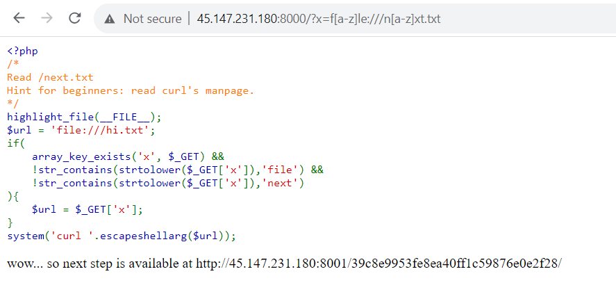

Last week, i participated in ASIS CTF 2023 with the Penyelam Handal team and managed to solve one challenge. The challenge that I solved was is Hello (Web). But, my teammates already solved it first.

**Challenge Description:**\
`welcome to asisctf!!`\
`http://45.147.231.180:8000`

**Analysis:**\
It is known, after i accessed the URL, the website displayed a source code / highlighted file index.php that seems to contain an image below.

<figure>

</figure>

The flow of the code is roughly like this:
1. There is a variable "url" initialized with the value "file:///hi.txt".
2. There is an if condition that validates the presence of the "x" parameter with the "GET" method and does not contain the words "file" and "next" in the parameter.
3. If the conditions is met, the "url" variable will be assigned the value of the "x" parameter ($_GET["x"]).
4. If the condition is not met, the system will immediately execute the "system()" function with arguments containing the initial value of the "url" variable (file:///hi.txt).
5. The "url" variable is escaped using the "escapeshellarg()" function to prevent input of other shell functions such as eval(), exec(), etc.

**The goals is to read /next.txt file. How to bypass the validation?**\
Since the system is running curl, we can bypass the validation of the words "file" and "next" using the "[]" or "{}" methods. You can find information about this in the manual for curl.

Here is the payload:
`f[a-z]le:///n[a-z]xt.txt`



**Okay, proceed to the next stage on the second website**

Based on the landing page URL, i was directed to the below endpoint, it is known that on this endpoint, local file reads can be performed with the response encoded in base64.


The index.js file was obtained by reading the /proc/self/cmdline file, where index.js is executed by Bun v1.0.2 (runtime, package manager, all in one toolkit for JavaScript and TypeScript).


But, i dont know what is name of the flag and where is the location. I then attempted to read the source code of the website at /app/index.js.

Here is the source code of the website:

``` js
const fs = require('node:fs');
const path = require('path')

/*
I wonder what is inside /next.txt  
*/

const secret = '39c8e9953fe8ea40ff1c59876e0e2f28'
const server = Bun.serve({
  port: 8000,
  fetch(req) {
  	let url = new URL(req.url);
  	let pname = url.pathname;
  	if(pname.startsWith(`/${secret}`)){
      if(pname.startsWith(`/${secret}/read`)){
        try{
          let fpath = url.searchParams.get('file');
          if(path.basename(fpath).indexOf('next') == -1){ 
            return new Response(fs.readFileSync(fpath).toString('base64'));
          } else {
            return new Response('no way');
          }
        } catch(e){ }
        return new Response("Couldn't read your file :(");
      }
      return new Response(`did you know i can read files?? amazing right,,, maybe try /${secret}/read/?file=/proc/self/cmdline`);
    }
    return 
  }
});
```

We are focused on this part of script:

``` js
        .....SNIP.....
          let fpath = url.searchParams.get('file');
          if(path.basename(fpath).indexOf('next') == -1){ 
            return new Response(fs.readFileSync(fpath).toString('base64'));
          } else {
            return new Response('no way');
        .....SNIP.....
```
The flow of the code is roughly like this:
1. The variable fpath contains the parameter "file".
2. There is if condition that checks if the path.basename() of the "path" variable does not contain the word "next" or in the script view if the response's indexOf("next") is equal to "-1" (indicating that the value is not found). If this condition is met, it will display the content of the file encoded in base64.
3. If the condition is not met, the response will display "no way".

**The goals also to read /next.txt file. How to bypass the validation again?**\
Since the source code utilizes fs.readFileSync() and path.basename(), we can bypass it using "null bytes".

Let's debug the code:

``` js
const fs = require('node:fs');
const path = require('path');

let fpath = "/next.txt\0/bypassed.txt";
console.log(fs.readFileSync(fpath).toString());
console.log(path.basename(fpath));
console.log(path.basename(fpath).indexOf("next"))
```


As seen in the debugging output above, fs.readFileSync() will only read up to /next.txt and anything after that is not read due to the presence of nullbytes ("\0"). Then, path.basename() will read the end of the file path, which is after the nullbytes. This causes path.basename() does not contain the word "next", fulfilling the condition, and it proceeds to read the file /next.txt.

So, let's execute it on the web challenge and we got the flag!


Thank you for reading this article, i hope it was helpful :-D\
**Follow me on: [Linkedin], [Medium], [Github], [Youtube], [Instagram]**

[Linkedin]: https://www.linkedin.com/in/muhammad-ichwan-banua/
[Medium]: https://banua.medium.com
[Github]: https://github.com/banuaa
[Youtube]: https://www.youtube.com/@muhammad.iwn-banua
[Instagram]: https://www.instagram.com/muhammad.iwn